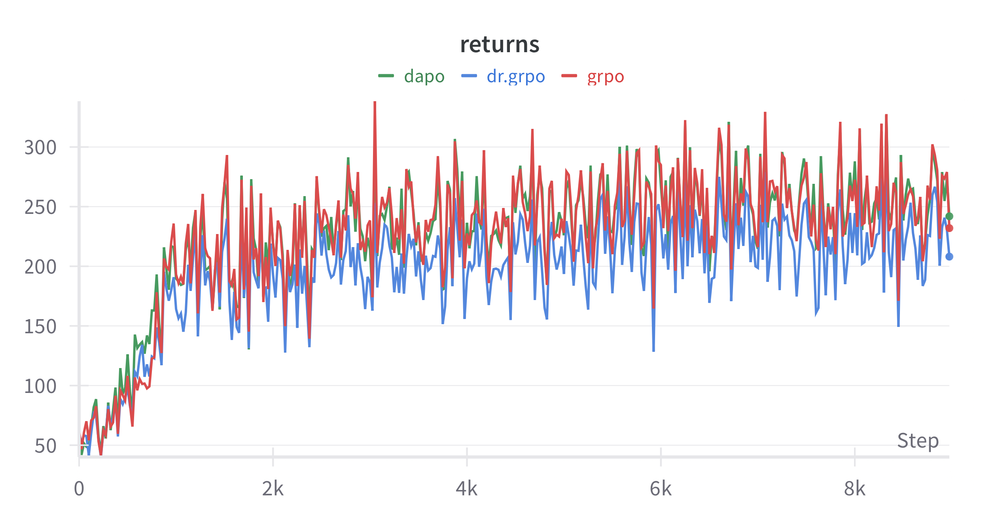
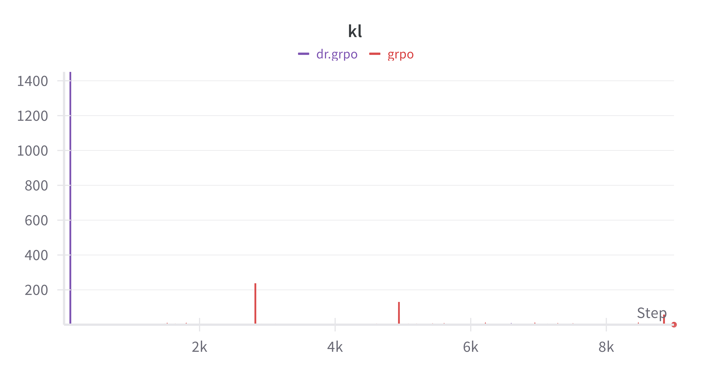

# tiny-grpo
A minimal, hackable implementation of Group Relative Policy Optimization (GRPO).

**Goal**: Implementation of GRPO for training a local `llama-3.2-3b` model using RL. Focus on understanding GRPO algorithm. Run everything locally with a single RTX A6000 node and Axolotl Docker image on RunPod.

This project is inspired by and builds upon [open-thought/tiny-grpo](https://github.com/open-thought/tiny-grpo).

### Updates

**[2025-07-15]** Supporting [DAPO](https://arxiv.org/abs/2503.14476), following this [huggingface/trl#3130 (comment)](https://github.com/huggingface/trl/issues/3130#issuecomment-2746947835).

- **Token-level Loss** is already implemented as `masked_mean`.     
- **Clip-Higher** is implemented in [huggingface/trl#3118 (comment)](https://github.com/huggingface/trl/pull/3118). DAPO recommends using `clip_eps_low = 0.2` and `clip_eps_high = 0.28`.
- **Dynamic Sampling (in progress)** is skipped in [huggingface/trl#3130 (comment)](https://github.com/huggingface/trl/issues/3130#issuecomment-2746947835) but has configurations implemented in [verl/dapo](https://verl.readthedocs.io/en/latest/algo/dapo.html).     
- **Overlong Filtering** is skipped (see the reason in [huggingface/trl#3130 (comment)](https://github.com/huggingface/trl/issues/3130#issuecomment-2746947835) and [verl/dapo](https://verl.readthedocs.io/en/latest/algo/dapo.html)).     
- **Soft Overlong Punishment** is implemented in [huggingface/trl#3130 (comment)](https://github.com/huggingface/trl/issues/3130#issuecomment-2746947835), with `L_cache = 0.2 * L_max` as observed in [verl/dapo](https://verl.readthedocs.io/en/latest/algo/dapo.html), where it treated `L_cache` as `overlong_buffer`.

**[2025-07-12]** Supporting [Dr.GRPO](https://arxiv.org/abs/2503.20783), with modifications in calculating {`masked_mean` with constant generation max tokens (512 from [oat/oat/args.py](https://github.com/sail-sg/oat/blob/main/oat/args.py))} and {`group_advantage` without std bias}, following [understand-r1-zero/train_zero_math.py](https://github.com/sail-sg/understand-r1-zero/blob/main/train_zero_math.py#L288).

### Setup

1. Spin up a RunPod instance

```
choose 1 RTX A6000 ($0.49/hr) on Axolotl Docker image.
```

2. Create conda env

```
conda create --name grpo python=3.12 -y
source ~/.bashrc # or ~/.zshrc if you're using zsh
conda init
conda activate grpo
```

3. Install dependencies

```
pip install -r requirements.txt
pip install hf_transfer
pip install flash-attn --no-build-isolation
```

4. HuggingFace and WandB login

```
huggingface-cli login
wandb login
```

5. Play with the source in `train.py`

```
python train.py
```

6. Transfer file from local computer to RunPod instance

```
scp -i ~/.ssh/id_ed25519 -P <port> <local_file_path> root@<host_name>:<remote_destination_path>
```

### Training Results

The run stopped at 9K steps due to insufficient storage memory. To prevent this, consider doubling the storage capacity or offloading checkpoints to temporary storage. 

- **(todo)** Train DAPO using GRPOLoss with a generation maximum length of 1024 and `soft_overlong_punishment`.
- Train DAPO using GRPOLoss with a generation maximum length of 512 and `default_reward`.
- Train GRPO and Dr.GRPO with a generation maximum length of 512 and `default_reward`.





### References

- [DAPO: An Open-Source LLM Reinforcement Learning System at Scale](https://arxiv.org/abs/2503.14476)
- [Understanding R1-Zero-Like Training: A Critical Perspective](https://arxiv.org/abs/2503.20783)
- [DeepSeek-R1 Tech Report](https://github.com/deepseek-ai/DeepSeek-R1/blob/main/DeepSeek_R1.pdf)
- [DeepSeekMath: Pushing the Limits of Mathematical Reasoning in Open Language Models](https://arxiv.org/abs/2402.03300)
